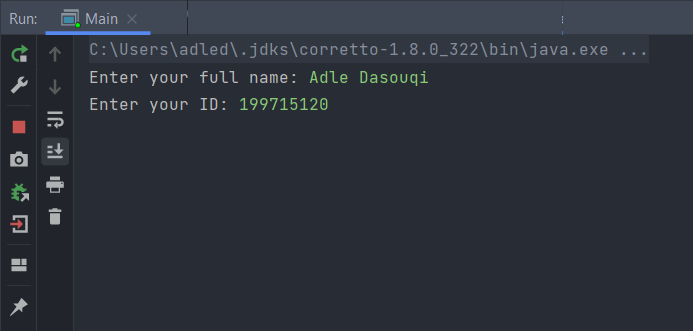
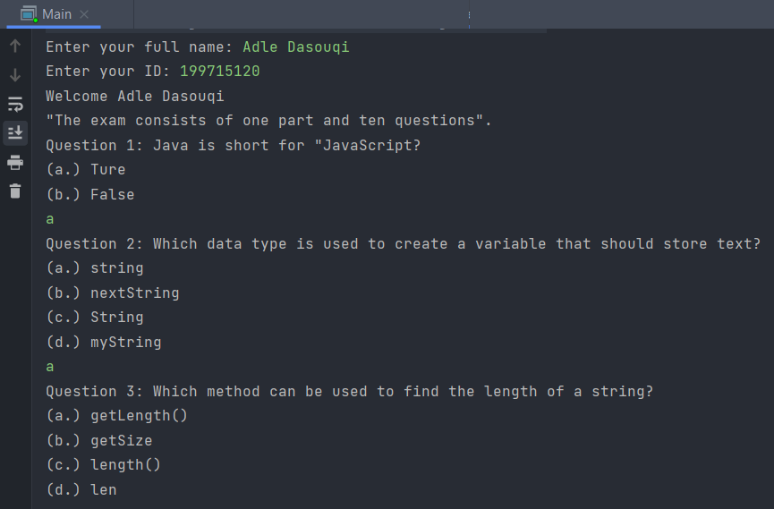

# Simple exam in Java 

    Simple exam in Java language. 
    As you know Java is a high-level programming language and platform, object-oriented and robust. 
    This is a simple project just to test your skills and knowledge in Java, 
    when you enter the exam you must type your <b>full name and ID number.</b> 
    For example:&#128071;&#127996;

 

    Then the exam starts, when you start the exam you have to select <b>one option among two or four options</b> 
    and so on.  
    Because the exam consists of <b>ten questions,</b> 
    at the end of the exam your scores will appear out of <b>10</b>. 
    For example:&#128071;&#127996;

    

